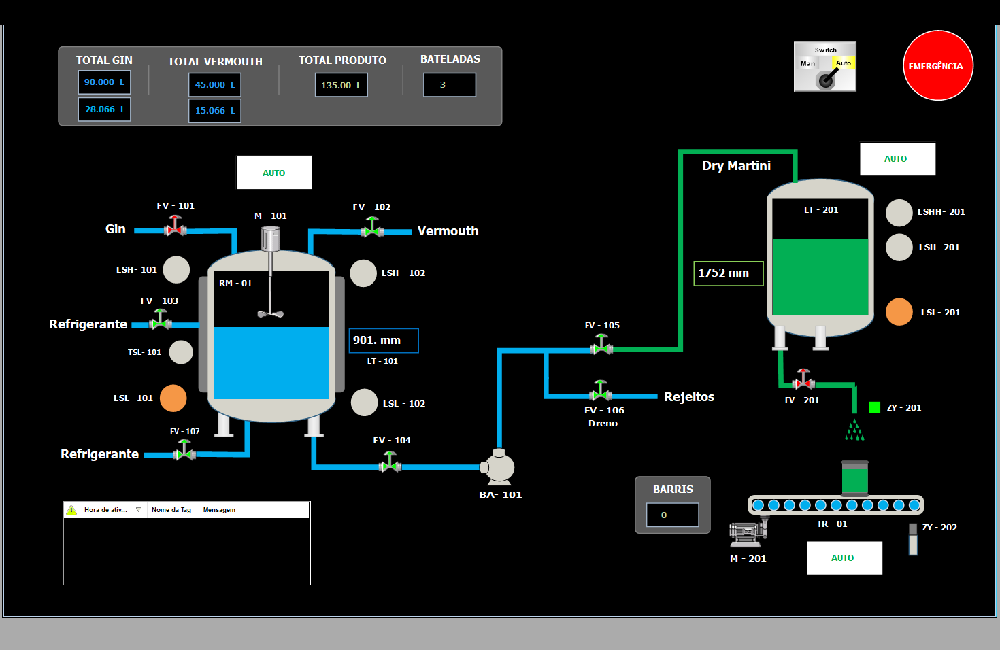
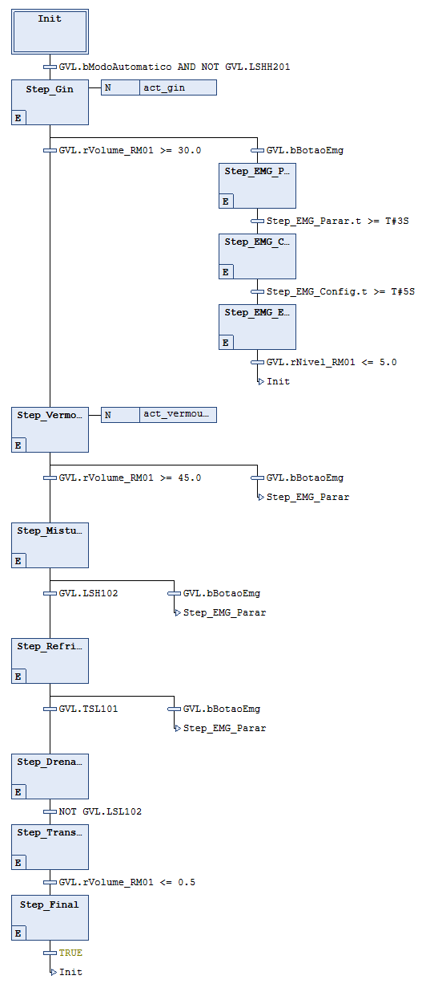

# 🍸 Automação de Produção de Dry Martini


> Projeto desenvolvido para a disciplina de **Informática Industrial** da **UFMG**. O sistema simula e controla uma planta industrial completa de mistura (batch) e envase de bebidas utilizando as normas IEC 61131-3.

---

## 📋 Índice

- [Visão Geral](#-visão-geral)
- [Arquitetura do Sistema](#-arquitetura-do-sistema)
- [Funcionalidades](#-funcionalidades)
- [Tecnologias Utilizadas](#-tecnologias-utilizadas)
- [Pré-requisitos e Execução](#-pré-requisitos-e-execução)
- [Lógica de Controle](#-lógica-de-controle)
- [Screenshots](#-screenshots)
- [Autores](#-autores)

---

## 🏭 Visão Geral

O projeto consiste na automação de duas áreas fabris distintas que operam em sincronia:

1.  **Área 01 (Processo de Mistura - Batch):**

    - Dosagem precisa de Gin (30L) e Vermouth (15L).
    - Controle de temperatura (resfriamento a 0°C) via jaqueta térmica.
    - Mistura com controle de velocidade variável (PWM).
    - Transferência para o tanque pulmão.

2.  **Área 02 (Envase e Transporte):**
    - Esteira transportadora inteligente com histerese (Liga > 50% / Desliga < 10%).
    - Posicionamento automático de barris.
    - Envase de 15L por unidade.
    - Contagem de produção.

---

## 🏗 Arquitetura do Sistema

O sistema opera em **Multitarefa** para separar a simulação física da lógica de controle, garantindo precisão temporal.

| Componente           | Função                           | Tecnologia                 |
| :------------------- | :------------------------------- | :------------------------- |
| **CLP Virtual**      | Controle Lógico e Sequencial     | CODESYS Control Win V3 x64 |
| **Simulação Física** | Modelagem dos Tanques e Sensores | Function Blocks (Ladder)   |
| **Supervisório**     | Interface de Operação (IHM)      | InduSoft Web Studio        |
| **Gateway**          | Troca de Dados                   | OPC UA Server/Client       |

---

## ✨ Funcionalidades

### 🎮 Modos de Operação

- **Automático:** Execução contínua da receita de Dry Martini e envase.
- **Manual:** Controle individual de válvulas e motores para manutenção.
- **Segurança (Emergência):** Rotina dedicada que interrompe o processo, descarta fluidos para o tanque de rejeitos e bloqueia o sistema.

### ⚙️ Destaques Técnicos

- **Controle PWM com Rampas:** Implementação em _Structured Text (ST)_ de um algoritmo de partida suave (Soft-Start 5s) e parada suave (Soft-Stop 10s) para o motor do misturador.
- **Sequenciamento em SFC:** A lógica da receita (Batelada) utiliza _Sequential Function Chart_ para clareza das etapas (Dosagem -> Mistura -> Transferência).
- **Alarme Inteligente:** Detecção de falha de transporte se nenhum barril passar pelo sensor em 15s.
- **Histerese:** Controle de nível do tanque de produto para evitar oscilação da esteira.

---

## 🛠 Tecnologias Utilizadas

O projeto segue estritamente a norma **IEC 61131-3**, utilizando a linguagem mais adequada para cada tarefa:

- **SFC (Sequential Function Chart):** Máquina de estados da batelada.
- **ST (Structured Text):** Algoritmos matemáticos (PWM e Rampas).
- **LD (Ladder Diagram):** Intertravamentos, alarmes e lógica booleana (Esteira).
- **OPC UA:** Protocolo padrão da indústria para integração CLP-SCADA.

---

## 💻 Pré-requisitos e Execução

Para rodar este projeto, você precisará de:

- CODESYS V3.5 (com Control Win V3 instalado).
- InduSoft Web Studio (Educational ou Full).

### Passo 1: O Backend (CODESYS)

1.  Abra o arquivo `.project` no CODESYS.
2.  Inicie o **CODESYS Control Win V3 x64** na bandeja do Windows.
3.  Faça o **Login** (`Alt+F8`) e coloque em **Run** (`F5`).
4.  Certifique-se de que a _Symbol Configuration_ foi compilada para expor as variáveis via OPC.

### Passo 2: O Frontend (InduSoft)

1.  Abra o projeto no InduSoft.
2.  Verifique na aba `Comm` se o Driver OPC UA aponta para `opc.tcp://localhost:4840`.
3.  Execute o projeto (`Play`).

---

## 🧠 Lógica de Controle

### Exemplo: Lógica PWM em ST

Trecho do código responsável pela rampa de aceleração do motor:

```pascal
// Cálculo da Rampa de Subida (0 a 100% em 5s)
IF tStartTimer.IN OR tStartTimer.Q THEN
    GVL.rVelocidade_Misturador := (TIME_TO_REAL(tStartTimer.ET) * 100.0) / 5000.0;

// Lógica de Geração do Pulso (20 Hz)
GVL.xSY101_PWM_Out := TIME_TO_REAL(tCycleTimer.ET) < (TIME_TO_REAL(tPeriodo) * (GVL.rVelocidade_Misturador / 100.0));
```

## 📸 Screenshots

Abaixo estão algumas capturas de tela do sistema supervisório e da simulação:

### 🖥️ Tela Principal – InduSoft SCADA



### 🧪 Sequenciamento da Batelada – SFC



---

## ✒️ Autores

| Nome            | Função          | GitHub                        |
| --------------- | --------------- | ----------------------------- |
| **Rian Rero**   | Desenvolvimento | https://github.com/Rian-Rero  |
| **Lara Strutz** | Desenvolvimento | https://github.com/larastrutz |
| **Luis Otavio** | Desenvolvimento | https://github.com/LuisOtavi0 |

### 👨‍🏫 Orientação

**Professor Emerson Alves da Silva**
